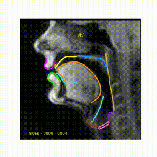
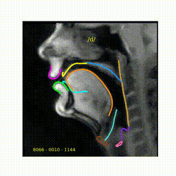

# Deep contour delineation of vocal tract articulaty structures from RT-MRI

<br>

 

<br>

# VT Tracker Dependency

This repository requires vt_tracker, which can be found at <a href="https://gitlab.inria.fr/vsouzari/vt_tracker">Inria's Gitlab</a>. To install the library, follow the instructions bellow.

<ol>

<li>Clone the repo</li>

```
>>> git clone git@gitlab.inria.fr:vsouzari/vt_tracker.git
```

<li>Install the repo</li>

```
>>> pip3 install -e /path/to/vt_tracker
```

</ol>
